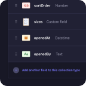
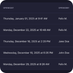
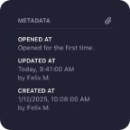
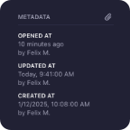

# Strapi Plugin: Document Metadata

A Strapi plugin that displays entity metadata, with an option to include the **"last opened"** details.

## ⏳ Installation

Install with NPM.

```bash
npm install strapi-plugin-document-metadata --save
```

Install with Yarn.

```bash
yarn add strapi-plugin-document-metadata
```

## 🔧 Usage

### 1. Configure the Plugin

Add the following configuration to your `config/plugins.ts` file. Create the file if it doesn’t already exist:

```ts
export default {
  // …
  'document-metadata': {
    enabled: true,
  },
};
```

Then restart the app to apply the changes.

### 2. Use in the Admin Panel

Once the plugin is installed, the **Document Metadata** card automatically appears when editing **collection types entries**. By default, it displays:

- Created at
- Created by
- Last updated at
- Last updated by

No additional setup is required for these fields.

#### Last Opened Metadata

To enable **Last Opened** tracking, add the following fields to your collection type using the Content-Type Builder:

| Field name | Type     | Required |
| ---------- | -------- | -------- |
| `openedAt` | DateTime | ❌       |
| `openedBy` | String   | ❌       |

Once these fields exist:

- The plugin automatically updates them when a document is opened.
- The metadata card will display the last opened date and user.

**Note:** To prevent these fields from showing up in the regular edit view, remove them under "Configure the view".

## 📸 Screenshots

Below are screenshots from an example application showing the document metadata in the list view and when editing an entry.

<a href="./assets/content-type-builder.png"/></a>&nbsp;&nbsp;<a href="./assets/content-manager-list-view.png"/></a>&nbsp;&nbsp;&nbsp;&nbsp;<a href="./assets/content-manager-first-time-opened.png"/></a>&nbsp;&nbsp;<a href="./assets/content-manager-last-time-opened.png"/></a>
